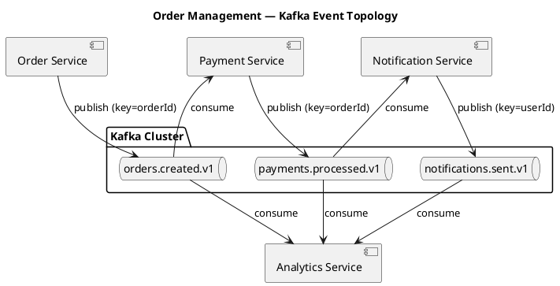

Ниже — проект сводного README для мини-проекта «Управление заказами». Он объединяет все созданные артефакты: описание архитектуры, топиков, сервисов, настройки Kafka, ссылки на AsyncAPI-контракты и PUML-диаграммы. Ты можешь сохранить его как `README.md` в корне репозитория.

```markdown
# Order Management — Kafka Event-Driven System

Документация асинхронного взаимодействия микросервисов через Apache Kafka.

## 1. Обзор

Система интернет-магазина, состоящая из четырёх микросервисов, которые
обмениваются событиями через Kafka. Сервисы развязаны по времени и скорости
обработки, а Kafka хранит историю событий для повторного чтения и аналитики.

## 2. Бизнес-сценарий

1. Клиент создаёт заказ в **Order Service**.
2. Order Service сохраняет заказ и публикует событие `orders.created`.
3. **Payment Service** обрабатывает платёж и публикует `payments.processed`.
4. **Notification Service** отправляет уведомление пользователю
   и публикует `notifications.sent`.
5. **Analytics Service** параллельно читает все три топика и строит метрики.

## 3. Архитектура



## 4. Топики

| Топик | Ключ | Партиции | RF | min.insync | Retention | Семантика |
|-------|------|----------|-----|------------|-----------|-----------|
| `orders.created.v1` | `orderId` | 12 | 3 | 2 | 7 дней | at-least-once |
| `payments.processed.v1` | `orderId` | 12 | 3 | 2 | 7 дней | exactly-once |
| `notifications.sent.v1` | `userId` | 6 | 3 | 2 | 3 дня | at-least-once |

Конвенция именования: `<домен>.<сущность>.<событие>.<версия>`.
Имя отражает бизнес-событие, а не технический сервис.

## 5. Сервисы и роли

| Сервис | Роль | Потребляет | Публикует |
|--------|------|-----------|-----------|
| Order Service | producer | — | `orders.created.v1` |
| Payment Service | consumer + producer | `orders.created.v1` | `payments.processed.v1` |
| Notification Service | consumer + producer | `payments.processed.v1` | `notifications.sent.v1` |
| Analytics Service | consumer | все три топика | — |

## 6. Гарантии доставки

- **At-least-once** — для `orders.created` и `notifications.sent`.
  Достигается отключением `enable.auto.commit` и ручным коммитом
  после успешной обработки. Потребители дедуплицируют по `eventId`.
- **Exactly-once** — для `payments.processed`.
  Достигается комбинацией:
  - продюсер: `acks=all` + `enable.idempotence=true` + транзакции;
  - консюмер: `isolation.level=read_committed` + `enable.auto.commit=false`;
  - атомарный коммит офсета вместе с публикацией результата
    (паттерн read-process-write).

## 7. Основные настройки Kafka

| Параметр | Значение по проекту |
|----------|---------------------|
| `acks` (продюсеры) | `all` |
| `enable.idempotence` (продюсеры) | `true` |
| `replication.factor` | 3 |
| `min.insync.replicas` | 2 |
| `enable.auto.commit` (консюмеры) | `false` |
| `isolation.level` (консюмеры) | `read_committed` |

## 8. AsyncAPI-контракты

Каждый контракт написан с точки зрения одного сервиса.

- `asyncapi/order-service.yaml` — публикация `orders.created.v1`
- `asyncapi/payment-service.yaml` — чтение `orders.created.v1`
  и публикация `payments.processed.v1`
- `asyncapi/notification-service.yaml` — чтение `payments.processed.v1`
  и публикация `notifications.sent.v1`
- `asyncapi/analytics-service.yaml` — чтение всех трёх топиков

Основные секции каждого контракта:
`info`, `servers`, `channels`, `operations`, `components.messages`,
`components.schemas`, `bindings.kafka`.

## 9. PUML-диаграммы

- `diagrams/component.puml` — общая топология
- `diagrams/order-service-sequence.puml` — Transactional Outbox
- `diagrams/payment-service-sequence.puml` — exactly-once и dedup
- `diagrams/notification-service-sequence.puml` — at-least-once и идемпотентность
- `diagrams/analytics-service-sequence.puml` — параллельное чтение

## 10. Интеграционные паттерны

- **Transactional Outbox** — в Order Service: событие пишется в таблицу `outbox`
  в одной БД-транзакции с заказом, затем публикуется в Kafka.
- **Идемпотентный потребитель** — во всех консюмерах: dedup по `eventId`.
- **Read-process-write** — в Payment Service: офсет входного события
  и публикация результата фиксируются в одной Kafka-транзакции.

## 11. Идемпотентность

Все события содержат:

- `eventId` (UUID) — для дедупликации;
- `occurredAt` — бизнес-время события.

Потребители хранят таблицу обработанных `eventId` и пропускают повторы.
Денежные суммы передаются строкой, валюта — по ISO 4217.

## 12. Как использовать

1. Импортировать AsyncAPI-контракты в AsyncAPI Studio для визуализации.
2. Сгенерировать клиентский код из контрактов при необходимости.
3. Собрать PUML-диаграммы в PlantUML для просмотра.
4. Использовать таблицы настроек как reference для разработчиков.
